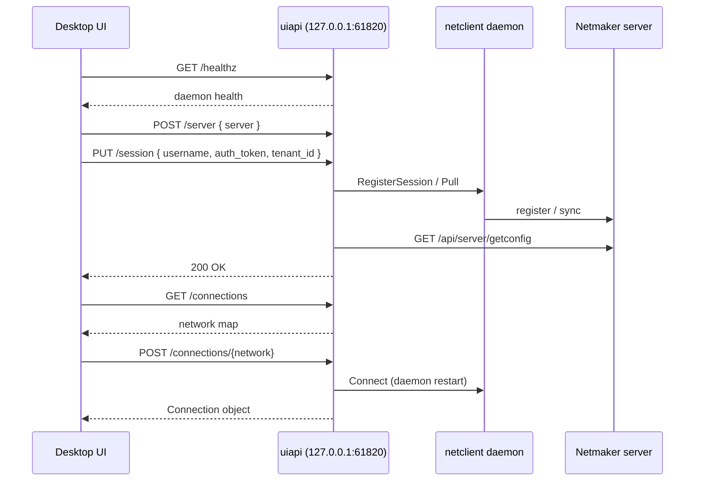

# Netclient Desktop UI API — Integration Spec

This document describes how the Netmaker desktop app integrates with the localhost REST API exposed by `netclient` via the `uiapi` package. The API replaces the standalone desktop daemon that was merged into netclient.

## Overview

| Item | Value |
|------|-------|
| **Base URL** | `http://127.0.0.1:61820` |
| **Protocol** | HTTP/1.1, JSON bodies |
| **Availability** | Started when the netclient daemon starts (including before first registration) |
| **Source** | `uiapi/` package, wired in `functions/uiapi_init.go` |

The desktop UI is a **thin client**: it handles login UX and network toggles; netclient owns WireGuard, registration, MQTT sync, and daemon lifecycle.

## Architecture



## Prerequisites

### Netclient daemon must be running

Install and start via `netclient install`. The desktop API starts as soon as the daemon process is up — including on first run before any server is registered.

### WireGuard dependency

`GET /healthz` reports whether the platform WireGuard utility is installed:

| OS | Utility checked |
|----|-----------------|
| Linux/macOS | `wg-quick` |
| Windows | `wireguard.exe` |

If missing, `status` is `"missing_dependencies"`. The UI should block connect actions and prompt the user to install WireGuard.

## Security

The API binds to `127.0.0.1:61820` only. No request authentication header is required — localhost access is the security boundary.

User authentication to Netmaker is handled separately via `PUT /session` (JWT or basic auth).

## Session persistence

Daemon persists **user** session state under the netclient config directory. **Server** context is owned by the daemon (`.serverctx` and `servers.json`).

| Platform | User session file |
|----------|-------------------|
| Linux | `/etc/netclient/.uisession.json` |
| macOS | `/Applications/Netclient/.uisession.json` |
| Windows | `C:\Program Files (x86)\Netclient\.uisession.json` |

On first load, netclient migrates `.uisession.json` from the legacy `netmaker-rac` directory if present. If still missing, user fields are migrated from legacy `ctx.json`; any server hostname in legacy files is written to `.serverctx`.

User file fields: `username`, `auth_token`, `tenant_id`, `server_config` (UI cache from Netmaker `getconfig`).

On daemon restart, user session is restored from `.uisession.json`; server is restored from `.serverctx`. `GET /server` returns `status: "running"` if a valid (non-expired) JWT is present.

## API Reference

### `GET /healthz`

**Response `200`**

```json
{
  "status": "ok",
  "current_version": "1.6.0",
  "latest_version": "1.6.0",
  "os": "darwin",
  "arch": "arm64",
  "wireguard_util": "wg-quick",
  "is_wireguard_util_installed": true
}
```

| Field | Values |
|-------|--------|
| `status` | `"ok"` \| `"missing_dependencies"` |
| `wireguard_util` | `"wg-quick"` \| `"wireguard.exe"` |

---

### `POST /server`

Set the Netmaker server hostname **before** login. No scheme — e.g. `"api.netmaker.example.com"`.

**Request**

```json
{ "server": "api.netmaker.example.com" }
```

**Responses**

| Code | Meaning |
|------|---------|
| `200` | Server set, or already set to same value |
| `400` | Empty server, invalid JSON, or session already active |
| `500` | Failed to persist session file |

**Rules**

- Writes `.serverctx` and sets `CurrServer` (netclient config dir). Does not store server in `.uisession.json`.
- Cannot change server while session is active.
- Idempotent if the same server is submitted again.

---

### `GET /server`

Current session and daemon status.

**Response `200`**

```json
{
  "status": "running",
  "server": "api.netmaker.example.com",
  "username": "user@example.com",
  "auth_token": "<jwt>",
  "tenant_id": "<uuid-or-empty>",
  "registered": true,
  "server_config": {}
}
```

| Field | Description |
|-------|-------------|
| `status` | `"idle"` \| `"loading"` \| `"restoring"` \| `"running"` \| `"closing"` |
| `server` | Registered/pending server from `.serverctx` / `servers.json` |
| `username` | Logged-in user |
| `auth_token` | JWT (present when session active) |
| `tenant_id` | Workspace tenant for MSP/SaaS; empty for classic non-MSP on-prem |
| `registered` | Whether the host is registered with the configured server (`servers.json`) |
| `server_config` | Populated only when session is active; fetched from Netmaker |

`server_config` is the Netmaker `config.ServerConfig` object (includes `rac_restrict_to_single_network`, `manage_dns`, `stun`, `default_domain`, etc.). Use `rac_restrict_to_single_network` to decide whether only one network can be connected at a time.

---

### `PUT /session`

Register or refresh the host against the configured server.

**Request**

```json
{
  "username": "user@example.com",
  "auth_token": "<user-jwt-from-netmaker-auth>",
  "tenant_id": "<uuid-or-empty>"
}
```

| Field | Required | Notes |
|-------|----------|-------|
| `username` | Yes | Trimmed |
| `auth_token` | Yes | User JWT from Netmaker (`POST /api/users/adm/authenticate` or OAuth) |
| `tenant_id` | No | Workspace tenant for MSP/SaaS; empty allowed for classic non-MSP on-prem |
| `password` | No | **Deprecated, ignored.** Desktop must authenticate with Netmaker first and pass only the JWT |

**Responses**

| Code | Body |
|------|------|
| `200` | Success |
| `400` | Missing fields, or `POST /server` not done first |
| `500` | `{ "message": "<error>" }` — registration/sync failed |

**Behavior**

1. Sets status → `"loading"`.
2. If username or `tenant_id` differs from the active session, disconnects prior networks (session handoff).
3. Calls `RegisterSession`:
   - **Already registered** (`servers.json` contains the active server) **and** host/server tenant matches `tenant_id`: align context if needed, run `PullForDesktop` only — no host re-register.
   - **Not registered**, or registered under a **different tenant**: `POST https://{server}/api/v1/device/register` with user JWT and `X-Tenant-ID`, then pull.
4. Fetches server config from `https://{server}/api/server/getconfig` with `Authorization: Bearer {auth_token}` and `X-Tenant-ID` when set (best-effort; failure is logged but does not fail the request).
5. Persists `username`, `auth_token`, `tenant_id`, and `server_config` (if fetched) to `.uisession.json` (user session only).
6. Sets status → `"running"` on success, `"idle"` on registration failure.

**Note:** After **first** device registration only, the daemon may restart. Re-login when `servers.json` is intact and tenant is unchanged should not re-register. Poll `GET /server` and `GET /healthz` until the API is back after first join.

---

### `DELETE /session`

Log out and disconnect all networks.

**Query params**

| Param | Values | Effect |
|-------|--------|--------|
| `clear_token` | `"true"` \| omitted | `"true"`: clear server + delete `.uisession.json`; otherwise keep server, clear credentials |

**Response `200`** — always returned even if underlying cleanup logs warnings.

**Behavior**

1. Status → `"closing"`.
2. Disconnects all connected networks.
3. Optionally clears server context from netclient config.
4. Status → `"idle"`.

---

### `POST /sync`

Pull latest config from the server and refresh local node state. Requires an active session.

**Response `200`** on success.

---

### `GET /networks`

List networks visible to the logged-in user (membership, JIT flags, connection state). Requires an active session.

**Response `200`** — array of `DeviceNetworkView`:

```json
[
  {
    "network_id": "my-network",
    "display_name": "My Network",
    "joined": true,
    "connected": false,
    "pending": false,
    "status": "active",
    "jit_enabled": false,
    "jit_applies_to_user": false,
    "has_jit_access": true,
    "jit_pending_request": false
  }
]
```

---

### `POST /networks/{network}/join`

Join the host to a network on the server. Requires an active session.

**Response `200`** on success.

---

### `DELETE /networks/{network}/leave`

Leave a network (disconnects locally if connected). Requires an active session.

**Response `200`** on success.

---

### `POST /networks/{network}/jit/request`

Submit a JIT access request (proxied to server `POST /api/v1/jit_user/request?network={network}`).

**Request**

```json
{ "reason": "Need access for troubleshooting" }
```

**Response `200`** on success.

---

### `GET /connections`

List all networks the host belongs to and their connection state.

**Precondition:** Active UI session **or** host registered to the configured server.

**Response `200`**

```json
{
  "my-network": {
    "status": "up",
    "address": "10.10.0.5/32",
    "mtu": 1280,
    "gateways": []
  },
  "other-network": {
    "status": "down",
    "mtu": 1280,
    "gateways": []
  }
}
```

| Field | Values |
|-------|--------|
| `status` | `"up"` \| `"down"` |
| `address` | Assigned IP CIDR when known |
| `mtu` | Default MTU (1280) |
| `peer` | Reserved; not populated yet |
| `gateways` | Always `[]` for now |

**Errors**

| Code | When |
|------|------|
| `400` | No session and not registered |
| `500` | `{ "message": "..." }` |

---

### `POST /connections/{network}`

Connect to a network.

**Path param:** `network` — exact network name from `GET /connections`.

**Response `200`**

Returns the `Connection` object for that network.

**Behavior**

1. Validates internet-gateway rules (only one IGW connection allowed).
2. If `server_config.rac_restrict_to_single_network` is true, disconnects all other connected networks first.
3. Calls `Connect()` → updates node config, publishes to server, **restarts daemon**.
4. Status transitions: `"loading"` → `"running"`.

**Errors**

| Code | Example message |
|------|-----------------|
| `400` | No session / not registered |
| `500` | `"no such network"`, `"node already connected"`, `"can have only one active connection to internet gateway"` |

**UI guidance:** Show a spinner while `GET /server` reports `"loading"`. Connect can take several seconds due to daemon restart.

---

### `DELETE /connections/{network}`

Disconnect from a network.

**Response `200`** — success, or already disconnected (idempotent).

**Errors**

| Code | When |
|------|------|
| `400` | Missing network name |
| `500` | Other disconnect failures |

---

## Recommended UI flows

### First-time setup

```
1. Ensure netclient daemon is installed and running (netclient install)
2. Poll GET /healthz until reachable (or show "daemon not running")
3. If healthz.status == "missing_dependencies" → prompt WireGuard install
4. POST /server { server: "<hostname>" }
5. User authenticates with Netmaker (SSO in browser / embedded webview)
6. PUT /session { username, auth_token: <jwt> }
7. Poll GET /server until status == "running"
8. GET /connections → render network list
```

### Returning user

```
1. GET /healthz
2. GET /server
   - status == "running" + valid auth_token → skip login
   - status == "idle" but server set → show login
   - expired JWT (session inactive) → re-login via PUT /session
3. GET /connections
```

### Connect / disconnect toggle

```
Connect:
  POST /connections/{network}
  Poll GET /connections until status == "up" (or server status != "loading")

Disconnect:
  DELETE /connections/{network}
  Poll GET /connections until status == "down"
```

### Logout

```
DELETE /session?clear_token=true   // full sign-out
DELETE /session                    // sign out but keep server for re-login
```

## Status lifecycle

| Status | When | UI behavior |
|--------|------|-------------|
| `idle` | No session | Show login |
| `loading` | Register, connect, disconnect in progress | Disable toggles, show spinner |
| `running` | Session active, op complete | Enable network controls |
| `closing` | Logout in progress | Brief transitional state |
| `restoring` | Defined but unused today | Treat like `loading` if seen |

Poll `GET /server` every **1–2 s** while `status == "loading"`.

Poll `GET /connections` every **2–5 s** while connected for live status (handshake/peer stats not yet exposed).

## Error handling

| HTTP | UI action |
|------|-----------|
| Connection refused | "Netclient daemon is not running" + link to install/start |
| `401` | No active UI session (network/device routes) |
| `400` | Show server-side validation message if present |
| `500` | Show `{ "message" }` body when present |

Common operational errors from connect/disconnect:

- `"no such network"` — host not joined to that network
- `"node already connected"` / `"node is already disconnected"` — refresh connections list
- `"can have only one active connection to internet gateway"` — disconnect existing IGW network first

## User authentication (desktop)

The desktop UI authenticates the user with Netmaker directly (basic auth or OAuth), then hands the resulting JWT to uiapi:

| Method | UI responsibility | API call |
|--------|-------------------|----------|
| **SSO/OAuth** | Complete OAuth with Netmaker; obtain JWT | `PUT /session` with `auth_token` = JWT |
| **Basic auth** | `POST /api/users/adm/authenticate` → JWT | `PUT /session` with `auth_token` = JWT (do not send user password to uiapi) |

Host registration uses the device REST API (`POST /api/v1/device/register`) only when `servers.json` has no entry for the configured server.

Netmaker server config (`server_config`) exposes auth-related fields (`authprovider`, `oidcissuer`, `frontendurl`, etc.) for building the SSO login URL in the UI.

## Platform notes

| Topic | Detail |
|-------|--------|
| Netclient config dir | Linux: `/etc/netclient/`, macOS: `/Applications/Netclient/`, Windows: `C:\Program Files (x86)\Netclient\` |
| UI user session | `.uisession.json` — username, JWT, UI `server_config` cache |
| Daemon server context | `.serverctx`, `servers.json` |
| Legacy desktop dir | Linux: `/opt/netmaker-rac/`, macOS: `/Users/Shared/netmaker-rac/`, Windows: `C:\Users\Public\netmaker-rac\` (migrated on first load) |
| Daemon install | `netclient install` registers OS service |
| Connect side-effect | Triggers daemon restart — expect brief API unavailability |
| Network names | URL path segment; encode special characters |
| CORS | Not applicable — localhost-only, no browser CORS |

## Migration from standalone desktop daemon

| Before (desktop daemon) | After (netclient uiapi) |
|-------------------------|-------------------------|
| Separate daemon binary | `netclient daemon` / OS service |
| Port `61821` | Port `61820` |
| Same route shapes | Same (`/healthz`, `/server`, `/session`, `/connections`) |
| Localhost only | `127.0.0.1:61820`, no auth header |

Desktop app changes should be minimal if it already spoke to the old daemon API — point at netclient's API and ensure the netclient service is installed.

## Known limitations

1. **Peer/gateway details:** `Connection.peer` and rich gateway data are not populated yet.
2. **`Restoring` status:** Reserved; not emitted today.
3. **Version check:** `latest_version` currently mirrors `current_version`.
4. **Real-time updates:** No WebSocket/SSE from uiapi — polling required.

## Quick reference

```
GET    /healthz                      → daemon health
POST   /server                       → set server hostname
GET    /server                       → session + status
PUT    /session                      → login / register
DELETE /session?clear_token=true     → logout
GET    /networks                       → list device networks
POST   /networks/{network}/join        → join network
DELETE /networks/{network}/leave       → leave network
POST   /networks/{network}/jit/request → request JIT access
POST   /sync                           → sync with server
GET    /connections                    → list connections
POST   /connections/{network}        → connect
DELETE /connections/{network}        → disconnect

Base:   http://127.0.0.1:61820
Postman: docs/uiapi-postman.json
```
